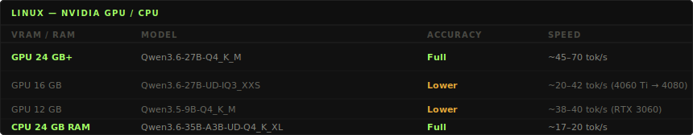
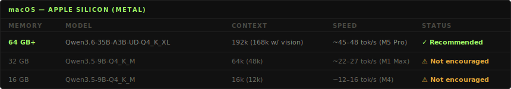

<div align="center">
  
</div>

<div align="center">
  <strong>Open-source coding agent. Local-first. Zero cost. Zero cloud.</strong><br/>
  <sub>Built to democratize AI. Powered by .NET.</sub>
</div>

<br>

<div align="center">
  <a href="#quickstart">Quickstart</a> · <a href="#whats-shipping">What's shipping</a> · <a href="#how-it-compares">How it compares</a> · <a href="#whats-inside">What's inside</a> · <a href="#supported-hardware">Hardware</a> · <a href="#docs">Docs</a> · <a href="ROADMAP.md">Roadmap</a> · <a href="#contributing">Contributing</a>
</div>

<br>

<div align="center">
  
</div>

<br>

<div align="center">
  
  
  
  
  
  
  
</div>

---

OpenMono is a coding agent that runs **entirely on your hardware** — no subscriptions, no data leaving your network, no per-token billing. It pairs a .NET 10 CLI with its own llama.cpp inference server, giving you a full agentic loop with **20 built-in tools**, Docker sandboxing, and deep code intelligence. NVIDIA GPU, CPU, or Apple Silicon (Metal) — **it auto-configures itself**. You own the model, the compute, and the data.

---

## Quickstart

```bash
bash <(curl -fsSL https://raw.githubusercontent.com/StartupHakk/OpenMonoAgent.ai/refs/heads/main/get-openmono.sh)
```

Then from any project:

```bash
openmono agent          # TUI mode (default)
openmono agent --classic    # classic scrolling terminal
```

<div align="center">
  
</div>

> [!NOTE]
> TUI mode is the default for interactive terminals. Use `openmono agent --classic` for CLI.

→ [Full command reference](docs/SETUP.md) — daily commands, setup flags, GPU/CPU options

---

<!--  ── WHAT'S SHIPPING ─────────────────────────────────────── -->
## What's shipping

<table width="100%" style="border-collapse:collapse;background:#111111;border:1px solid #232323;border-radius:4px;">
  <tr><td colspan="4" style="padding:8px 16px 6px;border-bottom:1px solid #232323;">
    <code style="font-size:11px;color:#A3FF66;letter-spacing:0.12em;">02 · WHAT'S SHIPPING</code>
  </td></tr>
  <tr>
    <td width="25%" valign="top" style="padding:14px 16px;border-right:1px solid #232323;border-top:2px solid #A3FF66;">
      <code style="font-size:10px;color:#A3FF66;">✓ SHIPPED · June 2026</code><br/><br/>
      <strong style="color:#A3FF66;">Web Search &amp; Scraping</strong><br/><br/>
      <sub style="color:#6A6A62;">Private, self-hosted search via SearXNG + anti-bot scraping via Scrapling. Your queries never leave the machine.</sub><br/><br/>
      <code style="font-size:11px;">openmono setup search</code>
    </td>
    <td width="25%" valign="top" style="padding:14px 16px;border-right:1px solid #232323;border-top:2px solid #A3FF66;">
      <code style="font-size:10px;color:#A3FF66;">✓ SHIPPED · June 2026</code><br/><br/>
      <strong style="color:#A3FF66;">Vision</strong><br/><br/>
      <sub style="color:#6A6A62;">Attach images in chat with <code>@screenshot.png</code>. mmproj downloads automatically. PNG, JPG, GIF, WebP.</sub><br/><br/>
      <code style="font-size:11px;">OPENMONO_VISION_ENABLED=1</code>
    </td>
    <td width="25%" valign="top" style="padding:14px 16px;border-right:1px solid #232323;border-top:2px solid #A3FF66;">
      <code style="font-size:10px;color:#A3FF66;">✓ SHIPPED</code><br/><br/>
      <strong style="color:#A3FF66;">Mobile App</strong><br/><br/>
      <sub style="color:#6A6A62;">Control your inference server from anywhere. Full agentic loop on iOS &amp; Android — no cloud, no third party.</sub><br/><br/>
      <a href="https://apps.apple.com/us/app/openmono-ai-coding-agent/id6766077801"><code style="font-size:11px;">App Store</code></a> &nbsp;·&nbsp; <a href="https://play.google.com/store/apps/details?id=ai.openmonoagent.app&hl=en_US"><code style="font-size:11px;">Google Play</code></a>
    </td>
    <td width="25%" valign="top" style="padding:14px 16px;border-top:2px solid #A3FF66;">
      <code style="font-size:10px;color:#A3FF66;">✓ SHIPPED</code><br/><br/>
      <strong style="color:#A3FF66;">VS Code &amp; Cursor Extension</strong><br/><br/>
      <sub style="color:#6A6A62;">Chat panel in your editor sidebar. Runs workspace tools locally — file edits, bash, grep, patches — while your local .NET agent handles the LLM. No cloud, no API key.</sub><br/><br/>
      <a href="https://marketplace.visualstudio.com/items?itemName=StartupHakk.openmono-agent"><code style="font-size:11px;">VS Code Marketplace</code></a>
    </td>
  </tr>
</table>

---

<!--  ── HOW IT COMPARES ─────────────────────────────────────── -->
## How it compares

Most coding agents are cloud products wearing an open-source label. Your prompts, your code, and your context hit someone else's servers on every keystroke. OpenMono runs the model on your hardware — after the one-time setup, **inference costs nothing**. Your code never leaves the machine. No account. No usage dashboard. No API key.

<table width="100%" style="border-collapse:collapse;background:#111111;border:1px solid #232323;border-radius:4px;">
  <tr><td colspan="4" style="padding:8px 16px 6px;border-bottom:1px solid #232323;">
    <code style="font-size:11px;color:#A3FF66;letter-spacing:0.12em;">HOW IT COMPARES</code>
  </td></tr>
  <tr>
    <td width="22%" style="padding:10px 16px;border-bottom:1px solid #232323;border-right:1px solid #232323;"></td>
    <td width="26%" style="padding:10px 16px;border-bottom:1px solid #232323;border-right:1px solid #232323;border-top:2px solid #A3FF66;"><strong style="color:#A3FF66;">OpenMono</strong></td>
    <td width="26%" style="padding:10px 16px;border-bottom:1px solid #232323;border-right:1px solid #232323;"><code style="font-size:11px;color:#4A4A44;">Claude Code</code></td>
    <td width="26%" style="padding:10px 16px;border-bottom:1px solid #232323;"><code style="font-size:11px;color:#4A4A44;">OpenCode</code></td>
  </tr>
  <tr>
    <td style="padding:9px 16px;border-bottom:1px solid #1A1A1A;border-right:1px solid #232323;"><sub style="color:#6A6A62;">Inference cost</sub></td>
    <td style="padding:9px 16px;border-bottom:1px solid #1A1A1A;border-right:1px solid #232323;"><sub style="color:#E2E2DA;">Zero per token (local)</sub></td>
    <td style="padding:9px 16px;border-bottom:1px solid #1A1A1A;border-right:1px solid #232323;"><sub style="color:#6A6A62;">Per-token billing</sub></td>
    <td style="padding:9px 16px;border-bottom:1px solid #1A1A1A;"><sub style="color:#6A6A62;">Per-token billing</sub></td>
  </tr>
  <tr>
    <td style="padding:9px 16px;border-bottom:1px solid #1A1A1A;border-right:1px solid #232323;"><sub style="color:#6A6A62;">Data privacy</sub></td>
    <td style="padding:9px 16px;border-bottom:1px solid #1A1A1A;border-right:1px solid #232323;"><sub style="color:#E2E2DA;">Fully offline capable</sub></td>
    <td style="padding:9px 16px;border-bottom:1px solid #1A1A1A;border-right:1px solid #232323;"><sub style="color:#6A6A62;">Cloud only</sub></td>
    <td style="padding:9px 16px;border-bottom:1px solid #1A1A1A;"><sub style="color:#6A6A62;">Depends on provider</sub></td>
  </tr>
  <tr>
    <td style="padding:9px 16px;border-bottom:1px solid #1A1A1A;border-right:1px solid #232323;"><sub style="color:#6A6A62;">Default inference</sub></td>
    <td style="padding:9px 16px;border-bottom:1px solid #1A1A1A;border-right:1px solid #232323;"><sub style="color:#E2E2DA;">llama.cpp bundled, zero config</sub></td>
    <td style="padding:9px 16px;border-bottom:1px solid #1A1A1A;border-right:1px solid #232323;"><sub style="color:#6A6A62;">Anthropic API required</sub></td>
    <td style="padding:9px 16px;border-bottom:1px solid #1A1A1A;"><sub style="color:#6A6A62;">BYO provider, no bundled inference</sub></td>
  </tr>
  <tr>
    <td style="padding:9px 16px;border-bottom:1px solid #1A1A1A;border-right:1px solid #232323;"><sub style="color:#6A6A62;">Sandboxing</sub></td>
    <td style="padding:9px 16px;border-bottom:1px solid #1A1A1A;border-right:1px solid #232323;"><sub style="color:#E2E2DA;">Docker-native</sub></td>
    <td style="padding:9px 16px;border-bottom:1px solid #1A1A1A;border-right:1px solid #232323;"><sub style="color:#6A6A62;">Host process</sub></td>
    <td style="padding:9px 16px;border-bottom:1px solid #1A1A1A;"><sub style="color:#6A6A62;">Host process</sub></td>
  </tr>
  <tr>
    <td style="padding:9px 16px;border-bottom:1px solid #1A1A1A;border-right:1px solid #232323;"><sub style="color:#6A6A62;">Code intelligence</sub></td>
    <td style="padding:9px 16px;border-bottom:1px solid #1A1A1A;border-right:1px solid #232323;"><sub style="color:#E2E2DA;">LSP + Roslyn + MCP graph tools</sub></td>
    <td style="padding:9px 16px;border-bottom:1px solid #1A1A1A;border-right:1px solid #232323;"><sub style="color:#6A6A62;">File reads</sub></td>
    <td style="padding:9px 16px;border-bottom:1px solid #1A1A1A;"><sub style="color:#6A6A62;">LSP (30+ servers)</sub></td>
  </tr>
  <tr>
    <td style="padding:9px 16px;border-bottom:1px solid #1A1A1A;border-right:1px solid #232323;"><sub style="color:#6A6A62;">Extensibility</sub></td>
    <td style="padding:9px 16px;border-bottom:1px solid #1A1A1A;border-right:1px solid #232323;"><sub style="color:#E2E2DA;">Playbooks (typed, composable)</sub></td>
    <td style="padding:9px 16px;border-bottom:1px solid #1A1A1A;border-right:1px solid #232323;"><sub style="color:#6A6A62;">Skills (markdown)</sub></td>
    <td style="padding:9px 16px;border-bottom:1px solid #1A1A1A;"><sub style="color:#6A6A62;">Plugins (TS SDK)</sub></td>
  </tr>
  <tr>
    <td style="padding:9px 16px;border-bottom:1px solid #1A1A1A;border-right:1px solid #232323;"><sub style="color:#6A6A62;">MCP</sub></td>
    <td style="padding:9px 16px;border-bottom:1px solid #1A1A1A;border-right:1px solid #232323;"><sub style="color:#E2E2DA;">Client (stdio)</sub></td>
    <td style="padding:9px 16px;border-bottom:1px solid #1A1A1A;border-right:1px solid #232323;"><sub style="color:#6A6A62;">Full client</sub></td>
    <td style="padding:9px 16px;border-bottom:1px solid #1A1A1A;"><sub style="color:#6A6A62;">Full client</sub></td>
  </tr>
  <tr>
    <td style="padding:9px 16px;border-right:1px solid #232323;"><sub style="color:#6A6A62;">UI</sub></td>
    <td style="padding:9px 16px;border-right:1px solid #232323;"><sub style="color:#E2E2DA;">TUI + CLI + VS Code + Mobile</sub></td>
    <td style="padding:9px 16px;border-right:1px solid #232323;"><sub style="color:#6A6A62;">Web, Desktop, VS Code, CLI</sub></td>
    <td style="padding:9px 16px;"><sub style="color:#6A6A62;">TUI, Desktop, Web</sub></td>
  </tr>
</table>

→ [Full architecture + diagram](docs/ARCHITECTURE.md) · [4 providers](docs/MODELS.md) · runs at **~45 tok/s on GPU**, ~20 tok/s on CPU

---

## What's inside

<table>
<tr>
<td width="50%" valign="top">

<strong style="color:#A3FF66;">01</strong> · **Bundled inference — zero config, zero cost**  
llama.cpp ships inside Docker. Installer detects your hardware and picks the right model. After setup, every token is free.

`GPU` Qwen3.6-27B dense · ~60 tok/s  
`CPU` Qwen3.6-35B-A3B MoE · ~20 tok/s  
`Mac` Qwen3.6-35B-A3B MoE · Metal · ~45–48 tok/s

→ [Models & reasoning mode](docs/MODELS.md)

</td>
<td width="50%" valign="top">

<strong style="color:#A3FF66;">02</strong> · **Agentic loop that earns its name**  
25 iterations per turn. Doom-loop detection aborts if the same tool sequence repeats 3×. Checkpoints at 65% context fill, compacts at 80%. Runs until done — then stops.

</td>
</tr>
<tr>
<td valign="top">

<strong style="color:#A3FF66;">03</strong> · **[20 tools](docs/ARCHITECTURE.md), 12-step pipeline**  
Every call: parse → schema validate → path sanity → plan-mode guard → capability check → cache → pre-hook → execute → post-hook → artifact store. Read-only tools run in parallel. Nothing bypasses the pipeline.

</td>
<td valign="top">

<strong style="color:#A3FF66;">04</strong> · **5 specialist sub-agents**  
Isolated sessions with locked tool sets and turn budgets:

`Explore` · read-only discovery · 15 turns  
`Plan` · architecture, no writes · 10 turns  
`Coder` · full file access · 30 turns  
`Verify` · adversarial + Roslyn · 20 turns  
`general-purpose` · everything · 25 turns

</td>
</tr>
<tr>
<td valign="top">

<strong style="color:#A3FF66;">05</strong> · **Docker sandbox**  
Project mounts as `/workspace`. The agent reads and writes your real files — that's the blast radius. Nothing outside that mount is visible or reachable.

</td>
<td valign="top">

<strong style="color:#A3FF66;">06</strong> · **Deep code intelligence**  
Roslyn: type hierarchy, blast-radius, cross-file symbol search, callers, diagnostics — 5-min compilation cache. LSP for TypeScript, Python, Go, Rust, lazy-started on first use.

Auto-detects [graphify](docs/graphify.md) (semantic concept graph, 25+ languages) and [code-review-graph](docs/code-review-graph.md) (structural call graph via MCP, ~22 tools) if installed — no config needed.

</td>
</tr>
<tr>
<td valign="top">

<strong style="color:#A3FF66;">07</strong> · **[Playbooks](docs/PLAYBOOKS.md)**  
YAML workflows with typed parameters, conditional gates, and checkpoint/resume. Composable — one playbook can call another.

</td>
<td valign="top">

<strong style="color:#A3FF66;">08</strong> · **[4 providers](docs/MODELS.md), hot-swappable**  
Local llama.cpp is the default and fully supported. OpenAI, Anthropic, and Ollama are available but WIP — see [Models](docs/MODELS.md) for details.

</td>
</tr>
<tr>
<td valign="top">

<strong style="color:#A3FF66;">09</strong> · **Distributed inference**  
Agent on your laptop, inference on a separate GPU machine. No port forwarding — tunnel is established outbound from the inference box. Free relay at [app.openmonoagent.ai](https://app.openmonoagent.ai).

→ [Dual-box setup guide](docs/SETUP.md#dual-box-setup)

</td>
<td valign="top">

<strong style="color:#A3FF66;">10</strong> · **Vision**  
Attach images in chat with `@screenshot.png` or ask the agent to read any image file. The multimodal projector (mmproj) is downloaded automatically at setup. Supported formats: PNG, JPG, GIF, WebP. Large images are auto-resized to fit within VRAM budget. Enable with `OPENMONO_VISION_ENABLED=1`.

→ [Vision setup & usage](docs/SETUP.md#vision)

</td>
</tr>
<tr>
<td valign="top">

<strong style="color:#A3FF66;">11</strong> · **Private web search & scraping**  
Self-hosted search via SearXNG — your queries never leave the machine. Anti-bot scraping via Scrapling + Camoufox (real browser, Cloudflare bypass). Single Caddy gateway, auto-detected. Falls back to DuckDuckGo / direct fetch when the gateway is absent.

`openmono setup search` · `openmono setup scraper`

→ [Web services architecture](docs/ARCHITECTURE.md#inference-side-web-services-caddy-gateway)

</td>
<td valign="top">

<strong style="color:#A3FF66;">12</strong> · **VS Code extension**  
The full agent loop in your editor sidebar — streaming responses, live Markdown, file edits, bash, and permission prompts without leaving VS Code. Connects to the local agent over ACP on port `7475`. Also works in Cursor.

`code --install-extension StartupHakk.openmono-agent`

→ [Extension docs](docs/SETUP.md#vs-code--cursor-extension) · [Marketplace](https://marketplace.visualstudio.com/items?itemName=StartupHakk.openmono-agent)

</td>
</tr>
</table>

<div align="center">
  
</div>

---

<!--  ── SUPPORTED HARDWARE ──────────────────────────────────── -->
## Supported Hardware



> [!NOTE]
> The installer detects your hardware and selects the right model automatically — no config needed. 12 GB and 16 GB GPU cards are supported but run lower accuracy models; for best results use a 24 GB card. Linux requires Ubuntu 26.04 LTS (recommended) or 25.10.



> [!NOTE]
> Requires Apple Silicon (M1+). **64 GB+ unified memory is the recommended configuration** — full-accuracy 35B model at the full 192k context. Less than 64 GB falls back to a smaller model with a tighter context window. Intel Macs are supported in **agent-only** mode (connect to a separate inference box). macOS 14+ (Sonoma/Sequoia) recommended.

---

<!--  ── DOCS ────────────────────────────────────────────────── -->
## Docs

| | |
|---|---|
| [Roadmap](ROADMAP.md) | What's next |
| [Setup & commands](docs/SETUP.md) | Daily commands, TUI vs classic, flags |
| [Architecture](docs/ARCHITECTURE.md) | .NET CLI + llama.cpp + Docker, full diagram |
| [Models & reasoning](docs/MODELS.md) | Model tiers, reasoning mode, provider config |
| [Configuration](docs/CONFIG.md) | settings.json, providers, permissions, MCP servers |
| [Playbooks](docs/PLAYBOOKS.md) | YAML workflows, typed params, checkpoint/resume |
| [graphify](docs/graphify.md) | Semantic code graph, 25+ languages |
| [code-review-graph](docs/code-review-graph.md) | Structural call graph via MCP |
| [VS Code extension](docs/SETUP.md#vs-code--cursor-extension) | Chat panel for VS Code 1.85+ · also works in Cursor · [Marketplace](https://marketplace.visualstudio.com/items?itemName=StartupHakk.openmono-agent) |
| [Contributing](CONTRIBUTING.md) | How to contribute |

> [!NOTE]
> OpenMono is in **Public Beta**. Early access is open, and we're shipping updates fast. Try it out and tell us what you'd like to see next.

---

## Contributing

OpenMono is early and moving fast. Contributions are welcome — new tools, providers, LSP servers, playbooks, bug fixes, or docs.

Read the [contributing guide](CONTRIBUTING.md) before opening a PR.

---

<div align="center">
  <br>
  <em>"AI shouldn't be a subscription you rent. It should be infrastructure you own —<br>sitting on your desk, serving your code, answering only to you."</em><br><br>
  <sub>— Startup Hakk</sub>
</div>

<br>

<div align="center">
  <a href="https://startuphakk.com"></a><br>
  <sub>GNU AFFERO GENERAL PUBLIC LICENSE v3.0 · © 2026 StartupHakk</sub>
</div>
